# 🌳 CivicAI Karnataka — Project Phases Architecture & Execution Flowcharts

This document decomposes the complete **Karnataka AI-Powered Civic Grievance Platform** into **17 sequential and modular phases**. It provides:
1. **Master Project Phases Tree Flowchart** illustrating inter-phase relationships and data flow.
2. **Individual Phase Deep Dives**, each featuring a **dedicated internal logic flowchart**, **how it works (short operational description)**, **key files & technologies**, and **inputs/outputs**.

---

## 🗺️ Master Project Phases Tree Flowchart

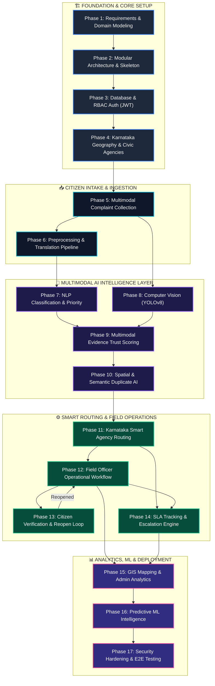

---

## 🔍 Phase-by-Phase Breakdown & Internal Tree Flowcharts

---

### Phase 1: Requirements, Domain Modeling & Specifications

#### Flowchart
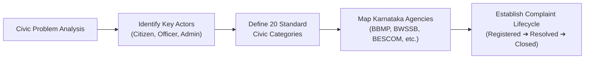

#### How It Works (Short Description)
* Establishes the municipal boundaries, roles, and grievance classifications for Bengaluru and Karnataka.
* Identifies 3 primary roles (**Citizen**, **Field Officer**, **System Admin**) and establishes 20 canonical civic categories across civic services (potholes, garbage, sewage, power lines, metro tracks, traffic).
* Specifies the full ticket lifecycle state machine and data retention requirements.
* **Key Files / Specs**: Domain rules in `PROJECT_DOCUMENTATION.md` & `backend/app/models/`.

---

### Phase 2: System Architecture & Modular Codebase Skeleton

#### Flowchart
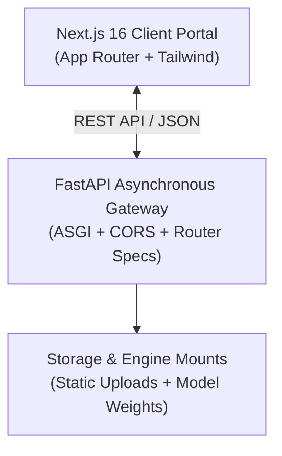

#### How It Works (Short Description)
* Constructs a clean separation between the frontend single-page web app and the asynchronous backend API.
* Sets up CORS policies, environment configurations (`config.py`), central routing `/api/v1`, static media upload folders, and global error handling middleware.
* **Key Files**: `backend/app/main.py`, `backend/app/core/config.py`, `frontend/package.json`.

---

### Phase 3: Database, Users & Role-Based Access Control (RBAC)

#### Flowchart
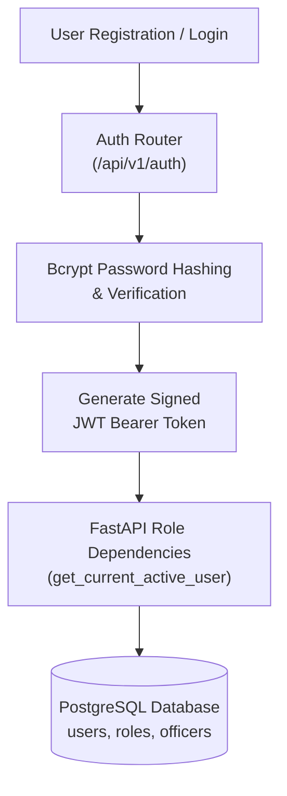

#### How It Works (Short Description)
* Implements relational schema management using SQLAlchemy 2.0 with PostgreSQL.
* Secures citizen and officer identity with Bcrypt password hashing and OAuth2 JWT tokens.
* Enforces role-based permissions: Citizens can only access their own filings, Officers access assigned field cases, and Admins oversee city-wide operations.
* **Key Files**: `backend/app/models/user.py`, `backend/app/routers/auth.py`, `backend/app/core/security.py`.

---

### Phase 4: Karnataka Geography & Civic Agency Master Model

#### Flowchart
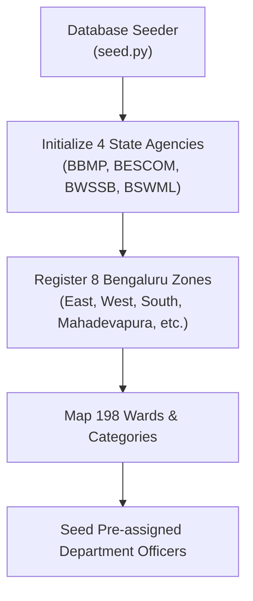

#### How It Works (Short Description)
* Seeds the spatial and departmental administrative hierarchy of Karnataka and Bengaluru.
* Binds grievance categories to responsible authorities (e.g. *Potholes & Roads* &rarr; **BBMP**, *Power & Outages* &rarr; **BESCOM**, *Water & Sewerage* &rarr; **BWSSB**, *Solid Waste Management* &rarr; **BSWML**).
* Populates initial test officers across all 8 civic zones for load testing.
* **Key Files**: `backend/app/seed.py`, `backend/app/models/department.py`.

---

### Phase 5: Citizen Multimodal Complaint Collection

#### Flowchart
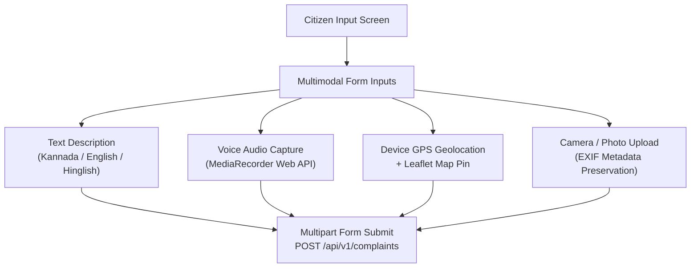

#### How It Works (Short Description)
* Provides a citizen-facing portal (`/report`) supporting text in multiple regional languages, audio voice recording, live GPS coordinate capture, and photographic evidence.
* Captures high-precision geolocation via browser Geolocation API and synchronizes with an interactive Leaflet map pin.
* **Key Files**: `frontend/src/app/report/page.tsx`, `backend/app/routers/complaints.py`.

---

### Phase 6: Preprocessing & Multilingual Translation Pipeline

#### Flowchart
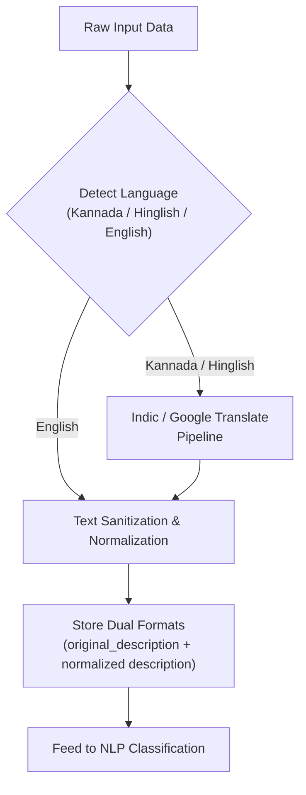

#### How It Works (Short Description)
* Normalizes multilingual inputs (Kannada, Hinglish, regional slang) into clean English text optimized for NLP models while preserving the citizen's original verbatim text.
* Stores voice audio recordings securely in static storage for officer review.
* **Key Files**: `backend/app/services/translation.py`.

---

### Phase 7: AI Classification & Priority Prediction Engine

#### Flowchart
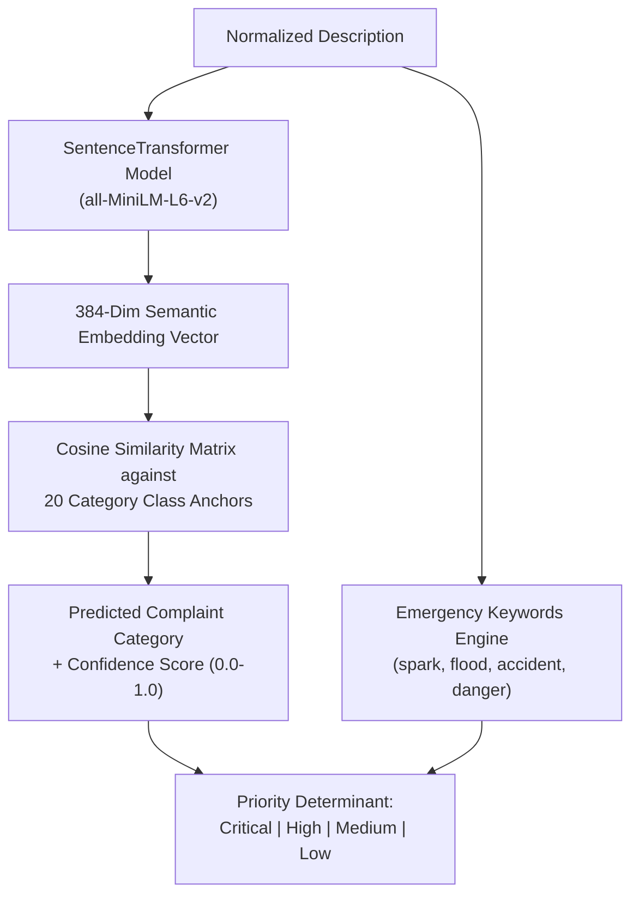

#### How It Works (Short Description)
* Uses SentenceTransformer (`all-MiniLM-L6-v2`) to produce 384-dimensional dense semantic embeddings of the complaint text.
* Classifies the text into one of 20 civic categories by calculating maximum cosine similarity against pre-computed category anchor vectors.
* Assesses severity using category risk weights and emergency keyword detection to assign priority: `Critical` (12h SLA), `High` (24h), `Medium` (48h), or `Low` (72h).
* **Key Files**: `backend/app/services/ai_classifier.py`.

---

### Phase 8: Structured Computer Vision & Image Quality Validation (YOLOv8 & OpenCV)

#### Flowchart
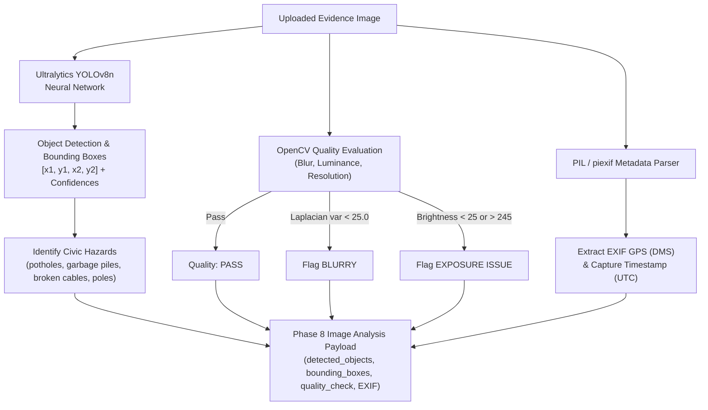

#### How It Works (Short Description)
* Ingests citizen-uploaded photos and runs real-time object detection using a lightweight YOLOv8 network (`yolov8n.pt`).
* Extracts structured detection payloads including categorized object classes, bounding boxes (`[x1, y1, x2, y2]`), and per-class confidence scores.
* Executes automated **OpenCV image quality diagnostics**:
  1. **Blurriness**: Evaluates Laplacian variance ($\text{var} < 25.0 \implies \text{BLURRY}$).
  2. **Exposure / Contrast**: Flags underexposed ($< 25$) or overexposed ($> 245$) whiteout images.
  3. **Resolution**: Enforces minimum dimensional sanity ($100 \times 100\text{ px}$).
* Uses PIL and `piexif` to extract embedded GPS coordinates and capture timestamps across standard EXIF and modern IFD sub-tables.
* **Key Files**: `backend/app/services/evidence.py`, `yolov8n.pt`.

---

### Phase 9: Hard-Gate Multimodal Evidence Verification & Trust Scoring Engine

#### Flowchart
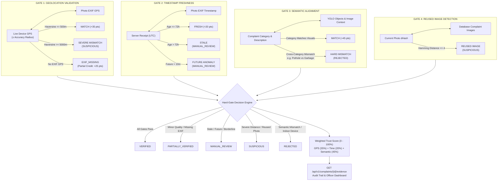

#### How It Works (Short Description)
* Enforces server-side authority with **4 Hard Verification Gates** to prevent spoofed, fraudulent, or recycled submissions:
  1. **Gate 1 (Geospatial Cross-Validation)**: Calculates Haversine distance between reported live device GPS and photo EXIF coordinates. Distance $\le 500\text{m}$ confirms `MATCH`. Distance $\ge 5000\text{m}$ triggers `SUSPICIOUS`. Missing EXIF gracefully falls back to `EXIF_MISSING`.
  2. **Gate 2 (Timestamp Freshness)**: Ensures photo was taken within 72 hours (`FRESH`). Photos $> 72\text{h}$ are flagged `STALE`, and future timestamps ($> 10\text{m}$) are flagged `FUTURE` $\to$ `MANUAL_REVIEW`.
  3. **Gate 3 (Semantic Agreement)**: Cross-checks complaint text and category against image features using `all-MiniLM-L6-v2` SentenceTransformers and YOLO indicators. Strict negative filters detect cross-category mismatches (e.g. Pothole complaint with Garbage photo). **Critical rule: Semantic mismatches are barred from ever receiving `VERIFIED` status and are routed to `REJECTED`**.
  4. **Gate 4 (Reused Image Detection)**: Computes a 64-bit difference perceptual hash (`dHash`). Bitwise Hamming distance $\le 4$ flags duplicate or re-submitted images across complaints, setting `is_reused_image = True` $\to$ `SUSPICIOUS`.
* **Decision States**: `VERIFIED`, `PARTIALLY_VERIFIED`, `MANUAL_REVIEW`, `SUSPICIOUS`, `REJECTED`.
* **Composite Trust Score (0–100%)**: Weighted composition: GPS ($35\%$), Timestamp ($20\%$), Semantic Vision ($45\%$). Clamped to $\le 24\%$ if `REJECTED` and $\le 35\%$ if `SUSPICIOUS`.
* **Audit API Endpoint**: `GET /api/v1/complaints/{id}/evidence` returns complete gate telemetry and explainable audit logs.
* **Key Files**: `backend/app/services/evidence.py`, `backend/test_evidence_gates.py`.

---

### Phase 10: Spatial & Semantic Duplicate Detection Engine

#### Flowchart
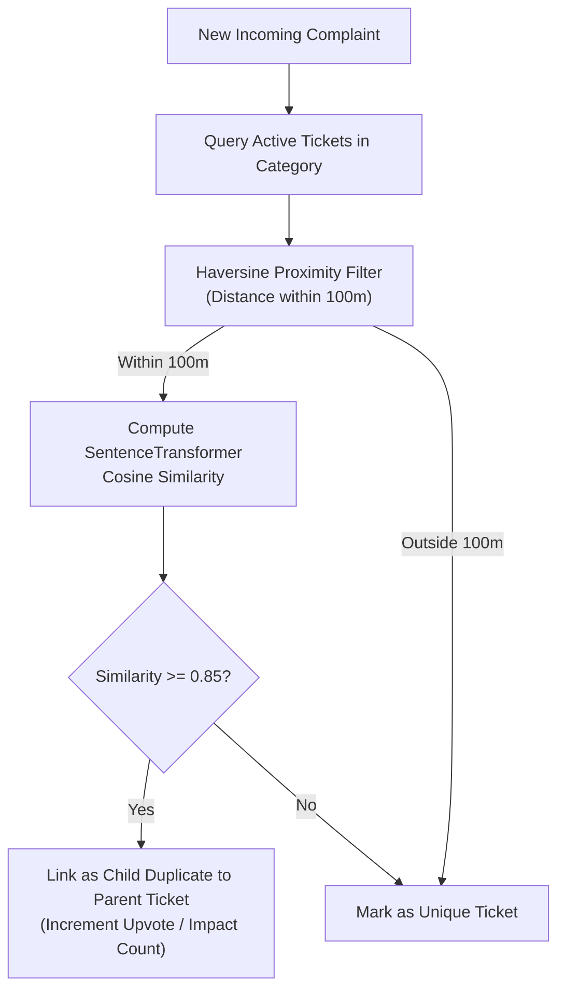

#### How It Works (Short Description)
* Eliminates redundant work orders for the same incident (e.g. 50 citizens reporting the same water burst or pothole).
* Applies a dual-gate screening algorithm:
  1. **Geospatial Proximity**: Filters active grievances within a 100-meter radius using the Haversine formula.
  2. **Semantic Similarity**: Computes cosine similarity of SentenceTransformer embeddings.
* If similarity score &ge; 0.85, associates the new report as a child duplicate of the master ticket, avoiding duplicate dispatches.
* **Key Files**: `backend/app/services/duplicate.py`.

---

### Phase 11: Karnataka Smart Routing Engine

#### Flowchart
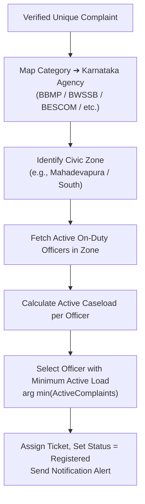

#### How It Works (Short Description)
* Eliminates manual dispatch delays through automated least-active load balancing.
* Identifies the responsible agency and geographical zone based on category and GPS coordinates.
* Assigns the case to the on-duty field officer with the lowest active caseload.
* Creates audit trail records in `complaint_status_history` and dispatches in-app notifications.
* **Key Files**: `backend/app/services/routing.py`.

---

### Phase 12: Field Officer Operational Workflow

#### Flowchart
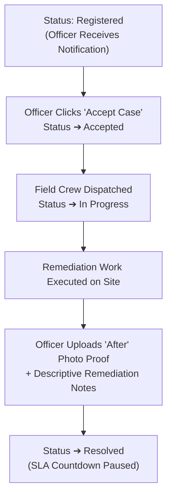

#### How It Works (Short Description)
* Provides a mobile-responsive dashboard for field officers (`/officer/dashboard`).
* Enforces an immutable progression sequence: `Registered` &rarr; `Accepted` &rarr; `In Progress` &rarr; `Resolved`.
* Strict resolution policy requires uploading photographic proof of resolution and entering remediation notes before a case can be marked resolved.
* **Key Files**: `frontend/src/app/officer/dashboard/page.tsx`, `backend/app/routers/complaints.py`.

---

### Phase 13: Citizen Verification & Reopen Feedback Loop

#### Flowchart
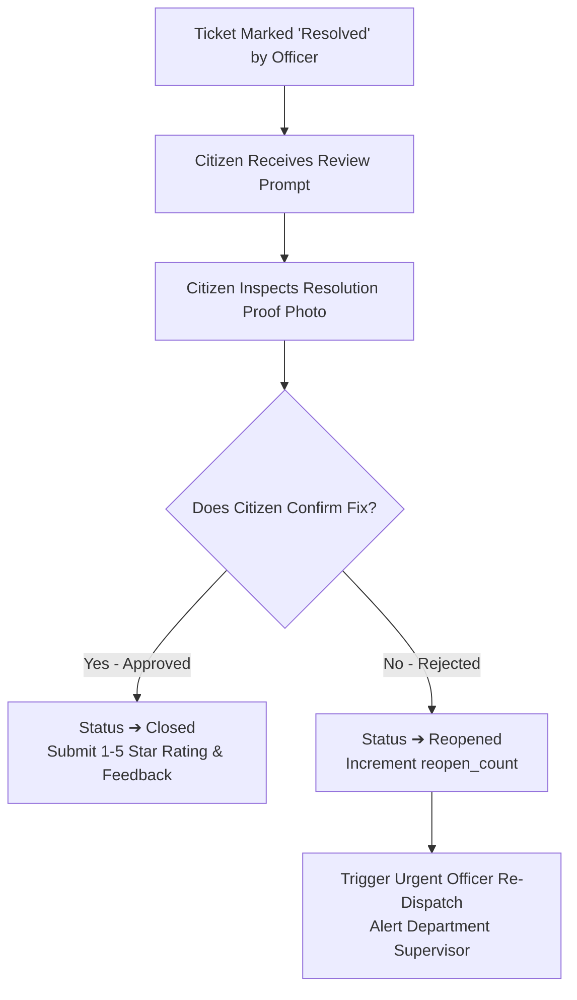

#### How It Works (Short Description)
* Places final verification authority in the hands of the reporting citizen.
* Citizens view the "Before" vs "After" photos on their dashboard.
* **Approved**: Ticket status becomes `Closed`, citizen submits a 1–5 star rating and optional comments.
* **Rejected**: Ticket status returns to `Reopened`, increments `reopen_count`, and triggers an urgent re-dispatch alert to the officer.
* **Key Files**: `frontend/src/app/citizen/dashboard/page.tsx`, `backend/app/routers/complaints.py`.

---

### Phase 14: SLA Tracking, Warning Timers & Escalation Engine

#### Flowchart
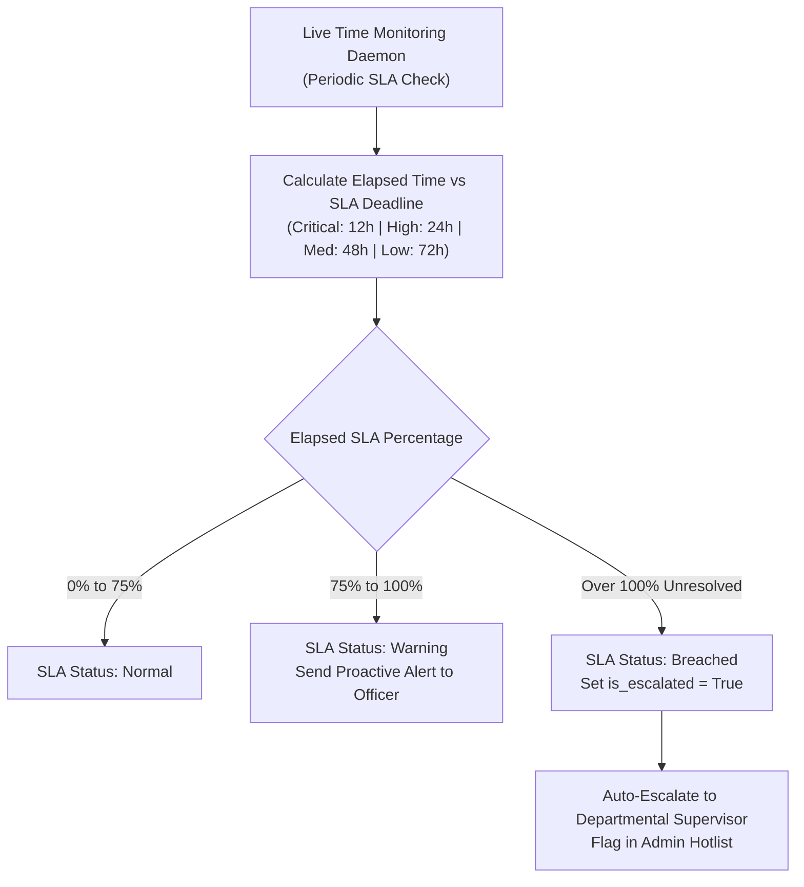

#### How It Works (Short Description)
* Automatically enforces citizen service charters based on grievance priority:
  * **Critical**: 12 hours
  * **High**: 24 hours
  * **Medium**: 48 hours
  * **Low**: 72 hours
* Dynamically shifts SLA status: `Normal` (&le; 75%) &rarr; `Warning` (75%–100%) &rarr; `Breached` (> 100%).
* Automatically flags overdue tickets (`is_escalated = True`) and notifies agency supervisors.
* **Key Files**: `backend/app/services/sla.py`.

---

### Phase 15: GIS Mapping & Operational Analytics Dashboard

#### Flowchart
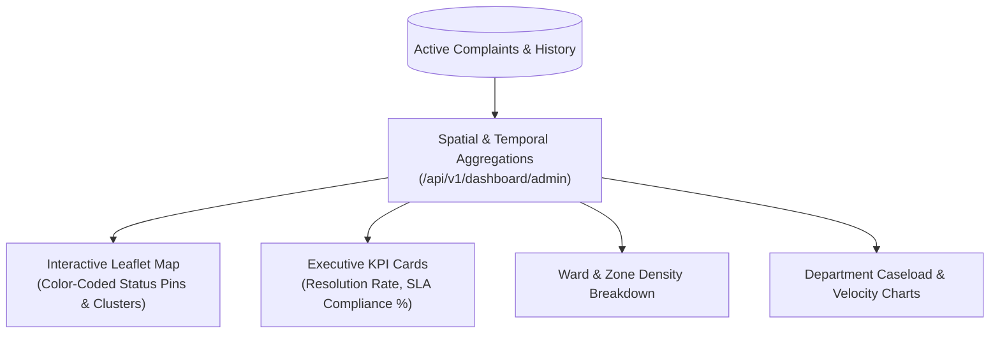

#### How It Works (Short Description)
* Centralized command-and-control center for state and municipal administrators (`/admin/dashboard`).
* Renders real-time geospatial pin clusters, ward-level complaint distribution, agency resolution velocity, and SLA compliance metrics.
* Enables filtering by agency, zone, status, priority, and date range.
* **Key Files**: `frontend/src/app/admin/dashboard/page.tsx`, `backend/app/routers/dashboard.py`.

---

### Phase 16: Predictive Machine Learning Intelligence & Early Warning

#### Flowchart
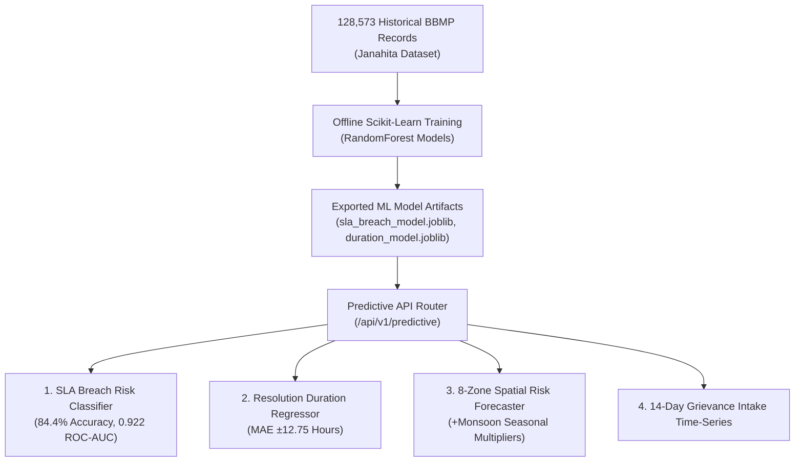

#### How It Works (Short Description)
* Adds predictive intelligence trained on **128,573 historical municipal records**.
* **SLA Breach Risk Predictor**: Evaluates category, zone, priority, and current backlog to estimate breach probability.
* **Resolution Duration Regressor**: Forecasts expected hours to resolve (MAE $\pm 12.75$ hours).
* **Spatial Risk Forecaster**: Ranks all 8 Bengaluru zones using seasonal monsoon multipliers (+35% to +45% during peak monsoon).
* **14-Day Intake Forecasting**: Projects future grievance volumes per department for proactive crew staffing.
* **Key Files**: `backend/app/services/predictive.py`, `backend/app/routers/predictive.py`.

---

### Phase 17: Security Hardening, Automated E2E Testing & Deployment

#### Flowchart
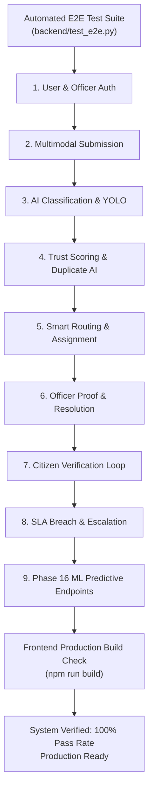

#### How It Works (Short Description)
* Verifies end-to-end platform integrity with an automated 13-step test suite covering the entire grievance lifecycle.
* Confirms zero regressions in ML inference, routing logic, SLA triggers, and Next.js frontend builds.
* **Key Files**: `backend/test_e2e.py`, `TESTING_GUIDE.md`.

---

## 📊 Summary Matrix: All 17 Phases at a Glance

| Phase # | Phase Name | Primary Technology / Tools | Key Input | Key Output |
|:---:|---|---|---|---|
| **1** | Requirements & Domain | Specification Specs | Civic Problems | 20 Categories, Roles, State Rules |
| **2** | System Architecture | FastAPI, Next.js 16 | System Scope | Modular skeleton, CORS, Routing |
| **3** | Database & RBAC | PostgreSQL, SQLAlchemy, JWT | User credentials | JWT tokens, Role guards, Tables |
| **4** | Karnataka Geography | Python Seeder | Civic structure | 5 Agencies, 8 Zones, 198 Wards |
| **5** | Multimodal Intake | React 19, Leaflet, MediaAPI | Citizen submission | Multi-part form payload |
| **6** | Translation & Clean | Indic / Google Translate | Raw KN/EN text | Normalized English text + Audio |
| **7** | NLP & Priority AI | SentenceTransformers (`all-MiniLM-L6-v2`) | Clean text | Category & Priority (`Critical` to `Low`) |
| **8** | YOLOv8 Computer Vision| Ultralytics YOLOv8n | Evidence photo | Detected objects & Bounding boxes |
| **9** | Evidence Trust Scoring | Haversine + EXIF + Agreement | GPS, Photo, Text | Composite Trust (0–100%) & Rating |
| **10** | Duplicate AI | Haversine + Cosine Sim | New complaint | Unique ticket OR Linked duplicate |
| **11** | Smart Agency Routing | Least-Load Balancing | Verified ticket | Dispatched officer & Status update |
| **12** | Officer Operations | Next.js Dashboard, REST | Assigned case | Proof photo & Status = `Resolved` |
| **13** | Citizen Verification | Next.js Dashboard, Rating | Resolution proof | `Closed` (Rating) OR `Reopened` |
| **14** | SLA Escalation | Periodic Daemon | Active timers | `Normal` &rarr; `Warning` &rarr; `Breached` |
| **15** | GIS Analytics | Leaflet, React, ChartJS | Ticket telemetry | Spatial pins, Hotspot heatmaps |
| **16** | Predictive ML | Scikit-Learn RandomForest | 128k records | SLA risk, Duration, 14-day forecasts |
| **17** | E2E Testing & Hardening| Python Unittest, Next Build | Full codebase | 100% test pass rate, Production build |
