# 🌳 CivicAI Karnataka — Project Phases Architecture & Execution Flowcharts

This document decomposes the complete **Karnataka AI-Powered Civic Grievance Platform** into **17 sequential and modular phases**. It provides:
1. **Master Project Phases Tree Flowchart** illustrating inter-phase relationships and data flow.
2. **Individual Phase Deep Dives**, each featuring a **dedicated internal logic flowchart**, **how it works (short operational description)**, **key files & technologies**, and **inputs/outputs**.

---

## 🗺️ Master Project Phases Tree Flowchart

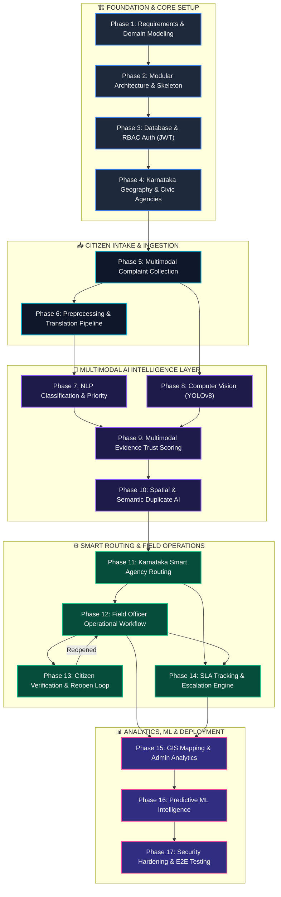
```mermaid
flowchart TD
    subgraph Foundation ["🏗️ FOUNDATION & CORE SETUP"]
        P1["Phase 1: Requirements & Domain Modeling"]
        P2["Phase 2: Modular Architecture & Skeleton"]
        P3["Phase 3: Database & RBAC Auth (JWT)"]
        P4["Phase 4: Karnataka Geography & Civic Agencies"]
        
        P1 --> P2
        P2 --> P3
        P3 --> P4
    end

    subgraph Intake ["📥 CITIZEN INTAKE & INGESTION"]
        P5["Phase 5: Multimodal Complaint Collection"]
        P6["Phase 6: Preprocessing & Translation Pipeline"]
        
        P4 --> P5
        P5 --> P6
    end

    subgraph AIIntelligence ["🧠 MULTIMODAL AI INTELLIGENCE LAYER"]
        P7["Phase 7: NLP Classification & Priority"]
        P8["Phase 8: Computer Vision (YOLOv8)"]
        P9["Phase 9: Multimodal Evidence Trust Scoring"]
        P10["Phase 10: Spatial & Semantic Duplicate AI"]
        
        P6 --> P7
        P5 --> P8
        P7 --> P9
        P8 --> P9
        P9 --> P10
    end

    subgraph Operations ["⚙️ SMART ROUTING & FIELD OPERATIONS"]
        P11["Phase 11: Karnataka Smart Agency Routing"]
        P12["Phase 12: Field Officer Operational Workflow"]
        P13["Phase 13: Citizen Verification & Reopen Loop"]
        P14["Phase 14: SLA Tracking & Escalation Engine"]
        
        P10 --> P11
        P11 --> P12
        P12 --> P13
        P11 --> P14
        P12 --> P14
        P13 -->|Reopened| P12
    end

    subgraph Analytics ["📊 ANALYTICS, ML & DEPLOYMENT"]
        P15["Phase 15: GIS Mapping & Admin Analytics"]
        P16["Phase 16: Predictive ML Intelligence"]
        P17["Phase 17: Security Hardening & E2E Testing"]
        
        P12 --> P15
        P14 --> P15
        P15 --> P16
        P16 --> P17
    end

    classDef foundation fill:#1e293b,stroke:#3b82f6,stroke-width:2px,color:#f8fafc;
    classDef intake fill:#0f172a,stroke:#06b6d4,stroke-width:2px,color:#f8fafc;
    classDef ai fill:#1e1b4b,stroke:#8b5cf6,stroke-width:2px,color:#f8fafc;
    classDef ops fill:#064e3b,stroke:#10b981,stroke-width:2px,color:#f8fafc;
    classDef analytics fill:#312e81,stroke:#ec4899,stroke-width:2px,color:#f8fafc;

    class P1,P2,P3,P4 foundation;
    class P5,P6 intake;
    class P7,P8,P9,P10 ai;
    class P11,P12,P13,P14 ops;
    class P15,P16,P17 analytics;
```

---

## 🔍 Phase-by-Phase Breakdown & Internal Tree Flowcharts

---

### Phase 1: Requirements, Domain Modeling & Specifications

#### Flowchart
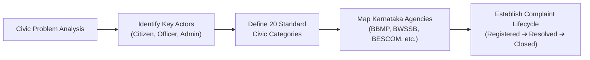
```mermaid
flowchart LR
    A["Civic Problem Analysis"] --> B["Identify Key Actors\n(Citizen, Officer, Admin)"]
    B --> C["Define 20 Standard\nCivic Categories"]
    C --> D["Map Karnataka Agencies\n(BBMP, BWSSB, BESCOM, etc.)"]
    D --> E["Establish Complaint Lifecycle\n(Registered ➔ Resolved ➔ Closed)"]
```

#### How It Works (Short Description)
* Establishes the municipal boundaries, roles, and grievance classifications for Bengaluru and Karnataka.
* Identifies 3 primary roles (**Citizen**, **Field Officer**, **System Admin**) and establishes 20 canonical civic categories across civic services (potholes, garbage, sewage, power lines, metro tracks, traffic).
* Specifies the full ticket lifecycle state machine and data retention requirements.
* **Key Files / Specs**: Domain rules in `PROJECT_DOCUMENTATION.md` & `backend/app/models/`.

---

### Phase 2: System Architecture & Modular Codebase Skeleton

#### Flowchart
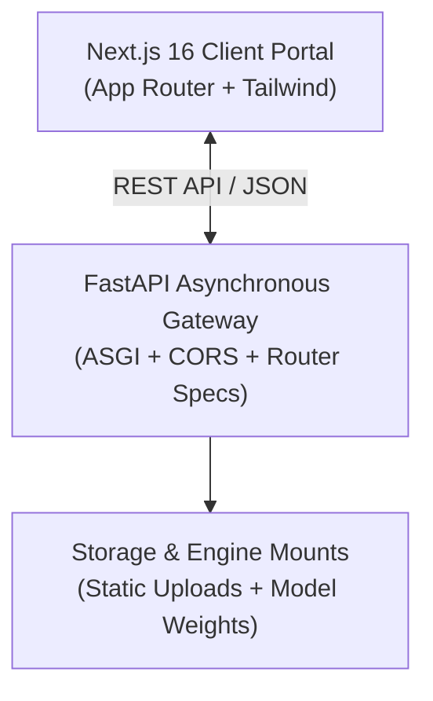
```mermaid
flowchart TD
    Client["Next.js 16 Client Portal\n(App Router + Tailwind)"] 
    API["FastAPI Asynchronous Gateway\n(ASGI + CORS + Router Specs)"]
    Storage["Storage & Engine Mounts\n(Static Uploads + Model Weights)"]
    
    Client <-->|REST API / JSON| API
    API --> Storage
```

#### How It Works (Short Description)
* Constructs a clean separation between the frontend single-page web app and the asynchronous backend API.
* Sets up CORS policies, environment configurations (`config.py`), central routing `/api/v1`, static media upload folders, and global error handling middleware.
* **Key Files**: `backend/app/main.py`, `backend/app/core/config.py`, `frontend/package.json`.

---

### Phase 3: Database, Users & Role-Based Access Control (RBAC)

#### Flowchart
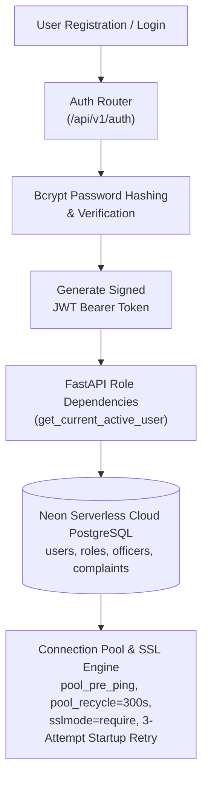
```mermaid
flowchart TD
    User["User Registration / Login"] --> Auth["Auth Router\n(/api/v1/auth)"]
    Auth --> Hash["Bcrypt Password Hashing\n& Verification"]
    Hash --> JWT["Generate Signed\nJWT Bearer Token"]
    JWT --> Guards["FastAPI Role Dependencies\n(get_current_active_user)"]
    Guards --> DB[(Neon Serverless Cloud PostgreSQL\nusers, roles, officers, complaints)]
    DB --> Pool["Connection Pool & SSL Engine\npool_pre_ping, pool_recycle=300s,\nsslmode=require, 3-Attempt Startup Retry"]
```

#### How It Works (Short Description)
* Implements relational schema management using SQLAlchemy 2.0 with **Neon serverless cloud PostgreSQL** as the primary production-grade database, with local PostgreSQL retained as a developer fallback.
* Enforces SSL encryption (`sslmode=require`), connection pooling resilience (`pool_pre_ping=True`, `pool_recycle=300`, `pool_size=10`, `max_overflow=20`), and an automated 3-attempt exponential startup retry to handle serverless cold starts gracefully.
* Secures citizen and officer identity with Bcrypt password hashing and OAuth2 JWT tokens.
* Enforces role-based permissions: Citizens can only access their own filings, Officers access assigned field cases, and Admins oversee city-wide operations.
* **Key Files**: `backend/app/models/user.py`, `backend/app/core/database.py`, `backend/app/routers/auth.py`, `backend/test_neon_connection.py`.

---

### Phase 4: Karnataka Geography & Civic Agency Master Model

#### Flowchart
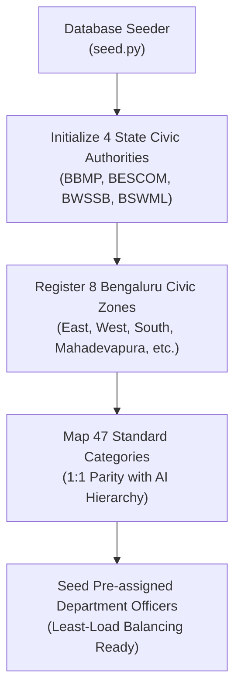
```mermaid
flowchart TD
    Seed["Database Seeder\n(seed.py)"] --> Agencies["Initialize 4 State Civic Authorities\n(BBMP, BESCOM, BWSSB, BSWML)"]
    Agencies --> Zones["Register 8 Bengaluru Civic Zones\n(East, West, South, Mahadevapura, etc.)"]
    Zones --> Categories["Map 47 Standard Categories\n(1:1 Parity with AI Hierarchy)"]
    Categories --> Staff["Seed Pre-assigned Department Officers\n(Least-Load Balancing Ready)"]
```

#### How It Works (Short Description)
* Seeds the spatial and departmental administrative hierarchy of Karnataka and Bengaluru across the **4 core municipal authorities**:
  1. **BBMP** (*Bruhat Bengaluru Mahanagara Palike*) &rarr; Roads, potholes, footpaths, stormwater drains (`Rajakaluves`), municipal streetlights, trees, lakes, and parks.
  2. **BESCOM** (*Bangalore Electricity Supply Company*) &rarr; Power outages, voltage fluctuations, sparking transformers, snapped wires, and electric utility poles.
  3. **BWSSB** (*Bangalore Water Supply and Sewerage Board*) &rarr; Water supply failures, pipe bursts, contaminated drinking water, and sewage/manhole overflows.
  4. **BSWML** (*Bengaluru Solid Waste Management Limited*) &rarr; Door-to-door collection delays, garbage blackspots, overflowing bins, open trash burning, and C&D waste.
* Enforces **1:1 parity across 47 standardized civic categories** between database records (`complaint_categories`) and code taxonomy (`CATEGORY_HIERARCHY`), resolving historical category drift.
* Populates initial test officers across all 8 civic zones for automated routing and load testing.
* **Key Files**: `backend/app/seed.py`, `backend/app/models/department.py`, `backend/app/services/ai.py`.

---

### Phase 5: Citizen Multimodal Complaint Collection

#### Flowchart
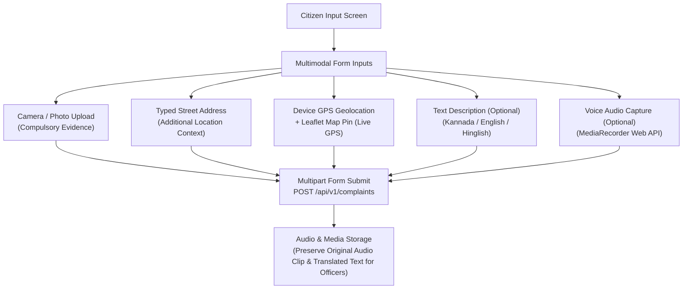
```mermaid
flowchart TD
    Citizen["Citizen Input Screen"] --> Forms["Multimodal Form Inputs"]
    Forms --> Photo["Camera / Photo Upload\n(Compulsory Evidence)"]
    Forms --> Addr["Typed Street Address\n(Additional Location Context)"]
    Forms --> GPS["Device GPS Geolocation\n+ Leaflet Map Pin (Live GPS)"]
    Forms --> Text["Text Description (Optional)\n(Kannada / English / Hinglish)"]
    Forms --> Audio["Voice Audio Capture (Optional)\n(MediaRecorder Web API)"]
    Photo --> Payload["Multipart Form Submit\nPOST /api/v1/complaints"]
    Addr --> Payload
    GPS --> Payload
    Text --> Payload
    Audio --> Payload
    Payload --> Storage["Audio & Media Storage\n(Preserve Original Audio Clip & Translated Text for Officers)"]
```

#### How It Works (Short Description)
* Provides a citizen-facing portal (`/report` and `/citizen/dashboard`) supporting multimodal inputs:
  1. **Mandatory Evidence Photo**: Photographic evidence is compulsory for AI verification and hard-gate checks. Submissions without image evidence are rejected at both frontend validation and backend API entry.
  2. **Typed Street Address & Live GPS**: Citizens can type street addresses or landmarks as additional location context while keeping high-precision device GPS capture and Leaflet interactive map pinning unchanged.
  3. **Optional Text & Multilingual Voice**: Text descriptions and voice notes are optional. If text is omitted, the system falls back gracefully to voice transcriptions or structured photo evidence markers.
  4. **Multilingual Audio Preservation**: The original audio recording is securely saved and linked (`audio_url`). Field officers can read the normalized translated text and listen directly to the original citizen audio clip in the Officer Dashboard.
* **Key Files**: `frontend/src/app/citizen/dashboard/page.tsx`, `frontend/src/app/officer/dashboard/page.tsx`, `backend/app/routers/complaints.py`.

---

### Phase 6: Preprocessing & Multilingual Translation Pipeline

#### Flowchart
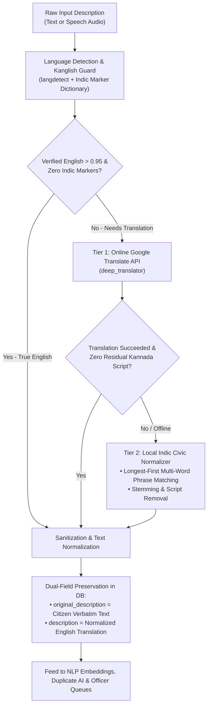
```mermaid
flowchart TD
    Raw["Raw Input Description\n(Text or Speech Audio)"] --> Detect["Language Detection & Kanglish Guard\n(langdetect + Indic Marker Dictionary)"]
    Detect --> Check{"Verified English > 0.95 &\nZero Indic Markers?"}
    Check -->|No - Needs Translation| Tier1["Tier 1: Online Google Translate API\n(deep_translator)"]
    Check -->|Yes - True English| Clean["Sanitization & Text Normalization"]
    Tier1 --> ScriptCheck{"Translation Succeeded &\nZero Residual Kannada Script?"}
    ScriptCheck -->|Yes| Clean
    ScriptCheck -->|No / Offline| Tier2["Tier 2: Local Indic Civic Normalizer\n• Longest-First Multi-Word Phrase Matching\n• Stemming & Script Removal"]
    Tier2 --> Clean
    Clean --> DualStore["Dual-Field Preservation in DB:\n• original_description = Citizen Verbatim Text\n• description = Normalized English Translation"]
    DualStore --> Downstream["Feed to NLP Embeddings, Duplicate AI & Officer Queues"]
```

#### How It Works (Short Description)
* Employs an intelligent **2-tier translation and transliteration pipeline** designed specifically for Karnataka's linguistic diversity (Kannada script, Romanized Kanglish, Hinglish, English):
  1. **High-Precision Kanglish / Hinglish Detection Guard**: Prevents Romanized vernacular text from bypassing translation due to false-positive English detection (`langdetect` English confidence must exceed 0.95 with zero Indic marker words).
  2. **Tier-1 Online Translation Engine**: Leverages `deep_translator` with Google Translator for natural, high-accuracy cross-language normalization.
  3. **Tier-2 Offline Local Dictionary Fallback**: Evaluates longest multi-word Kannada phrases first (e.g. `"ಬೀದಿ ದೀಪ"` &rarr; `"streetlight"`, `"ರಸ್ತೆ ಹಾಳಾಗಿದೆ"` &rarr; `"road is completely damaged"`) before single tokens, eliminating residual native script.
* **Dual-Field Non-Destructive Storage**: Preserves the citizen's original statement verbatim in `original_description` while storing the normalized English text in `description` for AI classification, vector embeddings, and field officer presentation.
* **Key Files**: `backend/app/services/ai.py` (`translate_text`), `backend/test_kanglish_duplicate.py`, `backend/test_multilingual_duplicate.py`, `backend/test_multiword_phrase_translation.py`.

---

### Phase 7: AI Classification & Priority Prediction Engine

#### Flowchart
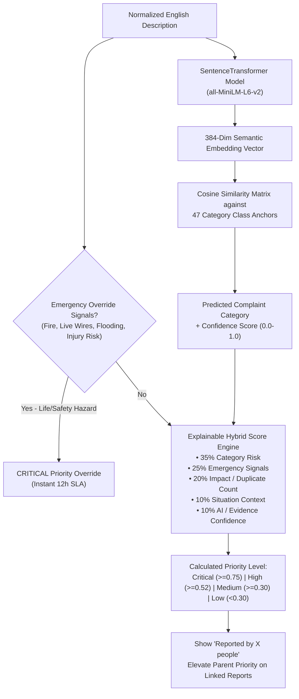
```mermaid
flowchart TD
    Text["Normalized English Description"] --> ST["SentenceTransformer Model\n(all-MiniLM-L6-v2)"]
    ST --> Embed["384-Dim Semantic Embedding Vector"]
    Embed --> Sim["Cosine Similarity Matrix against\n47 Category Class Anchors"]
    Sim --> TopClass["Predicted Complaint Category\n+ Confidence Score (0.0-1.0)"]
    
    Text --> EmCheck{"Emergency Override Signals?\n(Fire, Live Wires, Flooding, Injury Risk)"}
    EmCheck -->|Yes - Life/Safety Hazard| EmCrit["CRITICAL Priority Override\n(Instant 12h SLA)"]
    
    EmCheck -->|No| Hybrid["Explainable Hybrid Score Engine\n• 35% Category Risk\n• 25% Emergency Signals\n• 20% Impact / Duplicate Count\n• 10% Situation Context\n• 10% AI / Evidence Confidence"]
    TopClass --> Hybrid
    Hybrid --> Priority["Calculated Priority Level:\nCritical (>=0.75) | High (>=0.52) | Medium (>=0.30) | Low (<0.30)"]
    Priority --> Display["Show 'Reported by X people'\nElevate Parent Priority on Linked Reports"]
```

#### How It Works (Short Description)
* Uses SentenceTransformer (`all-MiniLM-L6-v2`) to produce 384-dimensional dense semantic embeddings of the normalized English complaint text.
* Classifies the text into one of **47 standardized civic categories** by calculating maximum cosine similarity against pre-computed category anchor vectors.
* **Explainable Hybrid Priority Score (0.0 - 1.0)**: Computes priority using an objective 5-factor weighted formula:
  1. **35% Category Baseline Risk**: Inherited from departmental risk weighting (high-voltage electricity, sewer collapses, water contamination vs. cosmetic issues).
  2. **25% Emergency Signal Score**: Detected hazard keywords (sparks, fumes, sinkhole, toxic, collapsing, explosion).
  3. **20% Duplicate / Citizen Impact Count**: Multi-reporter escalation ($\text{score} = \min(1.0, 0.20 \times \text{impact\_count})$). Displays *"Reported by X people"* on UI cards and automatically elevates parent priority when additional citizens report the same issue.
  4. **10% Situation Context**: Sensitive location modifiers (proximity to hospitals, schools, metro stations, arterial highways, or junctions).
  5. **10% AI / Evidence Confidence**: Model certainty and image verification agreement score.
* **Strict Emergency Priority Overrides**: Submissions indicating immediate life-safety hazards (e.g. `fire`, `live wire / electrocution`, `severe flash flooding / drowning`, or `injury risk / open trench`) bypass scoring and are permanently locked to `Critical` priority (12h SLA).
* **Key Files**: `backend/app/services/ai.py` (`classify_complaint`, `predict_priority`), `backend/app/routers/complaints.py`.

---

### Phase 8: Structured Computer Vision & Image Quality Validation (YOLOv8 & OpenCV)

#### Flowchart
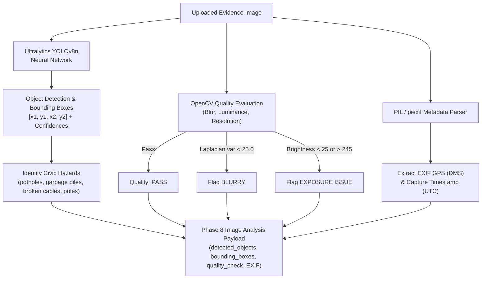
```mermaid
flowchart TD
    Img["Uploaded Evidence Image"] --> Pre["OpenCV Quality Evaluation\n(Blur, Luminance, Resolution)"]
    Pre -->|Laplacian var < 25.0| FlagBlur["Flag BLURRY"]
    Pre -->|Brightness < 25 or > 245| FlagExp["Flag EXPOSURE ISSUE"]
    Pre -->|Pass| PassQ["Quality: PASS"]
    
    Img --> YOLO["Ultralytics YOLOv8n\nNeural Network"]
    YOLO --> Detect["Object Detection & Bounding Boxes\n[x1, y1, x2, y2] + Confidences"]
    Detect --> Classes["Identify Civic Hazards\n(potholes, garbage piles, broken cables, poles)"]
    
    Img --> EXIF["PIL / piexif Metadata Parser"]
    EXIF --> EXIFData["Extract EXIF GPS (DMS)\n& Capture Timestamp (UTC)"]
    
    Classes --> Payload["Phase 8 Image Analysis Payload\n(detected_objects, bounding_boxes, quality_check, EXIF)"]
    PassQ --> Payload
    FlagBlur --> Payload
    FlagExp --> Payload
    EXIFData --> Payload
```

#### How It Works (Short Description)
* Ingests citizen-uploaded photos and runs real-time object detection using a lightweight YOLOv8 network (`yolov8n.pt`).
* Extracts structured detection payloads including categorized object classes, bounding boxes (`[x1, y1, x2, y2]`), and per-class confidence scores.
* Executes automated **OpenCV image quality diagnostics**:
  1. **Blurriness**: Evaluates Laplacian variance ($\text{var} < 25.0 \implies \text{BLURRY}$).
  2. **Exposure / Contrast**: Flags underexposed ($< 25$) or overexposed ($> 245$) whiteout images.
  3. **Resolution**: Enforces minimum dimensional sanity ($100 \times 100\text{ px}$).
* Uses PIL and `piexif` to extract embedded GPS coordinates and capture timestamps across standard EXIF and modern IFD sub-tables.
* **Key Files**: `backend/app/services/evidence.py`, `yolov8n.pt`.

---

### Phase 9: Hard-Gate Multimodal Evidence Verification & Trust Scoring Engine

#### Flowchart
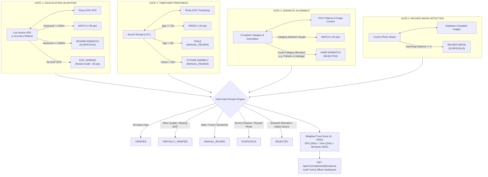
```mermaid
flowchart TD
    subgraph Gate1 ["GATE 1: GEOLOCATION VALIDATION"]
        LiveGPS["Live Device GPS\n(± Accuracy Radius)"] <--> EXIFGPS["Photo EXIF GPS"]
        LiveGPS -->|Haversine <= 500m| GeoMatch["MATCH (+35 pts)"]
        LiveGPS -->|Haversine >= 5000m| GeoCritical["SEVERE MISMATCH\n(SUSPICIOUS)"]
        LiveGPS -->|No EXIF GPS| GeoMissing["EXIF_MISSING\n(Partial Credit: +25 pts)"]
    end

    subgraph Gate2 ["GATE 2: TIMESTAMP FRESHNESS"]
        ServerTime["Server Receipt (UTC)"] <--> PhotoTime["Photo EXIF Timestamp"]
        ServerTime -->|Age <= 72h| Fresh["FRESH (+20 pts)"]
        ServerTime -->|Age > 72h| Stale["STALE\n(MANUAL_REVIEW)"]
        ServerTime -->|Future > 10m| Future["FUTURE ANOMALY\n(MANUAL_REVIEW)"]
    end

    subgraph Gate3 ["GATE 3: SEMANTIC ALIGNMENT"]
        NLPDesc["Complaint Category & Description"] <--> YOLOFeat["YOLO Objects & Image Context"]
        NLPDesc -->|Category Matches Visuals| SemMatch["MATCH (+45 pts)"]
        NLPDesc -->|Cross-Category Mismatch\ne.g. Pothole vs Garbage| SemMismatch["HARD MISMATCH\n(REJECTED)"]
    end

    subgraph Gate4 ["GATE 4: REUSED IMAGE DETECTION"]
        CurImg["Current Photo dHash"] <--> PrevImgs["Database Complaint Images"]
        CurImg -->|Hamming Distance <= 4| Reused["REUSED IMAGE\n(SUSPICIOUS)"]
    end

    Gate1 --> DecisionEngine{"Hard-Gate Decision Engine"}
    Gate2 --> DecisionEngine
    Gate3 --> DecisionEngine
    Gate4 --> DecisionEngine

    DecisionEngine -->|All Gates Pass| DecVerified["VERIFIED"]
    DecisionEngine -->|Minor Quality / Missing EXIF| DecPartial["PARTIALLY_VERIFIED"]
    DecisionEngine -->|Stale / Future / Borderline| DecReview["MANUAL_REVIEW"]
    DecisionEngine -->|Severe Distance / Reused Photo| DecSuspicious["SUSPICIOUS"]
    DecisionEngine -->|Semantic Mismatch / Indoor Device| DecRejected["REJECTED"]

    DecisionEngine --> CalcScore["Weighted Trust Score (0 - 100%)\nGPS (35%) + Time (20%) + Semantic (45%)"]
    CalcScore --> Audit["GET /api/v1/complaints/{id}/evidence\nAudit Trail & Officer Dashboard"]
```

#### How It Works (Short Description)
* Enforces server-side authority with **4 Hard Verification Gates** to prevent spoofed, fraudulent, or recycled submissions:
  1. **Gate 1 (Geospatial Cross-Validation)**: Calculates Haversine distance between reported live device GPS and photo EXIF coordinates. Distance $\le 500\text{m}$ confirms `MATCH`. Distance $\ge 5000\text{m}$ triggers `SUSPICIOUS`. Missing EXIF gracefully falls back to `EXIF_MISSING`.
  2. **Gate 2 (Timestamp Freshness)**: Ensures photo was taken within 72 hours (`FRESH`). Photos $> 72\text{h}$ are flagged `STALE`, and future timestamps ($> 10\text{m}$) are flagged `FUTURE` $\to$ `MANUAL_REVIEW`.
  3. **Gate 3 (Semantic Agreement)**: Cross-checks complaint text and category against image features using `all-MiniLM-L6-v2` SentenceTransformers and YOLO indicators. Strict negative filters detect cross-category mismatches (e.g. Pothole complaint with Garbage photo). **Critical rule: Semantic mismatches are barred from ever receiving `VERIFIED` status and are routed to `REJECTED`**.
  4. **Gate 4 (Reused Image Detection)**: Computes a 64-bit difference perceptual hash (`dHash`). Bitwise Hamming distance $\le 4$ flags duplicate or re-submitted images across complaints, setting `is_reused_image = True` $\to$ `SUSPICIOUS`.
* **Decision States**: `VERIFIED`, `PARTIALLY_VERIFIED`, `MANUAL_REVIEW`, `SUSPICIOUS`, `REJECTED`.
* **Composite Trust Score (0–100%)**: Weighted composition: GPS ($35\%$), Timestamp ($20\%$), Semantic Vision ($45\%$). Clamped to $\le 24\%$ if `REJECTED` and $\le 35\%$ if `SUSPICIOUS`.
* **Audit API Endpoint**: `GET /api/v1/complaints/{id}/evidence` returns complete gate telemetry and explainable audit logs.
* **Key Files**: `backend/app/services/evidence.py`, `backend/test_evidence_gates.py`.

---

### Phase 10: Spatial & Semantic Duplicate Detection Engine

#### Flowchart
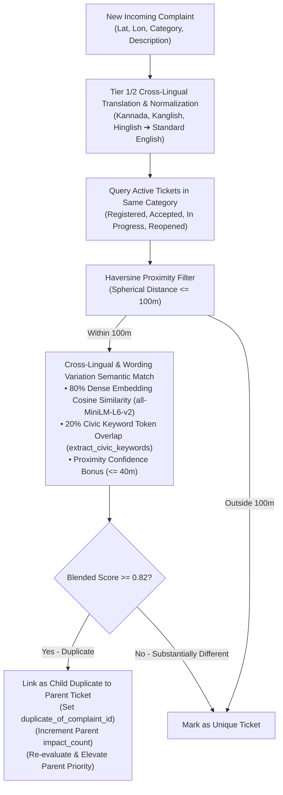
```mermaid
flowchart TD
    New["New Incoming Complaint\n(Lat, Lon, Category, Description)"] --> Trans["Tier 1/2 Cross-Lingual Translation & Normalization\n(Kannada, Kanglish, Hinglish ➔ Standard English)"]
    Trans --> Active["Query Active Tickets in Same Category\n(Registered, Accepted, In Progress, Reopened)"]
    Active --> Radius["Haversine Proximity Filter\n(Spherical Distance <= 100m)"]
    Radius -->|Within 100m| BlendSim["Cross-Lingual & Wording Variation Semantic Match\n• 80% Dense Embedding Cosine Similarity (all-MiniLM-L6-v2)\n• 20% Civic Keyword Token Overlap (extract_civic_keywords)\n• Proximity Confidence Bonus (<= 40m)"]
    Radius -->|Outside 100m| Unique["Mark as Unique Ticket"]
    
    BlendSim --> Check{"Blended Score >= 0.82?"}
    Check -->|Yes - Duplicate| Merge["Link as Child Duplicate to Parent Ticket\n(Set duplicate_of_complaint_id)\n(Increment Parent impact_count)\n(Re-evaluate & Elevate Parent Priority)"]
    Check -->|No - Substantially Different| Unique
```

#### How It Works (Short Description)
* Eliminates redundant work orders for the same incident (e.g. multiple citizens reporting the same water main burst or road crater) across language boundaries and diverse phrasing variations.
* **Cross-Lingual & Wording Variation Embedding Match**:
  1. Translates incoming text in any supported language (pure Kannada script, Romanized Kanglish, Hinglish, or English) to normalized English first.
  2. Extracts domain civic keywords (`extract_civic_keywords`), stripping stopwords to protect against differing phrasing styles (e.g. *"gundi biddide"* vs *"dangerous crater pothole"*).
  3. Blends dense SentenceTransformer semantic similarity ($80\%$) with keyword token Jaccard similarity ($20\%$), augmented with a spatial proximity bonus for complaints within 40m.
* **Spatial & Same-Category Constraint**: Retains the strict requirement that grievances must belong to the same civic category and fall within a 100-meter radius via Haversine distance.
* **Parent Impact & Escalation**: Increments the parent ticket's `impact_count`, displays *"Reported by X people"* across Citizen and Officer dashboards, and automatically elevates the parent ticket's priority and SLA if the aggregated impact count warrants it.
* **Key Files**: `backend/app/services/duplicate.py`, `backend/test_kanglish_duplicate.py`, `backend/test_multilingual_duplicate.py`, `backend/test_enhancements.py`.

---

### Phase 11: Karnataka Smart Routing Engine

#### Flowchart
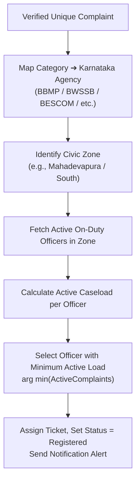
```mermaid
flowchart TD
    Ticket["Verified Unique Complaint"] --> Agency["Map Category ➔ Karnataka Agency\n(BBMP / BWSSB / BESCOM / etc.)"]
    Agency --> Zone["Identify Civic Zone\n(e.g., Mahadevapura / South)"]
    Zone --> Officers["Fetch Active On-Duty Officers in Zone"]
    Officers --> LoadCalc["Calculate Active Caseload per Officer"]
    LoadCalc --> Min["Select Officer with Minimum Active Load\narg min(ActiveComplaints)"]
    Min --> Dispatch["Assign Ticket, Set Status = Registered\nSend Notification Alert"]
```

#### How It Works (Short Description)
* Eliminates manual dispatch delays through automated least-active load balancing.
* Identifies the responsible agency and geographical zone based on category and GPS coordinates.
* Assigns the case to the on-duty field officer with the lowest active caseload.
* Creates audit trail records in `complaint_status_history` and dispatches in-app notifications.
* **Key Files**: `backend/app/services/routing.py`.

---

### Phase 12: Field Officer Operational Workflow

#### Flowchart
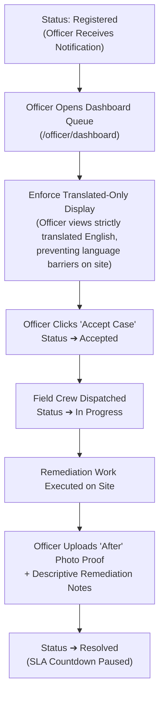
```mermaid
flowchart TD
    Reg["Status: Registered\n(Officer Receives Notification)"] --> View["Officer Opens Dashboard Queue\n(/officer/dashboard)"]
    View --> TransView["Enforce Translated-Only Display\n(Officer views strictly translated English,\npreventing language barriers on site)"]
    TransView --> Accept["Officer Clicks 'Accept Case'\nStatus ➔ Accepted"]
    Accept --> Prog["Field Crew Dispatched\nStatus ➔ In Progress"]
    Prog --> Fix["Remediation Work Executed on Site"]
    Fix --> Proof["Officer Uploads 'After' Photo Proof\n+ Descriptive Remediation Notes"]
    Proof --> Resolved["Status ➔ Resolved\n(SLA Countdown Paused)"]
```

#### How It Works (Short Description)
* Provides a mobile-responsive dashboard for field officers (`/officer/dashboard`).
* **Enforced Translated-Only English Display**: Field officers and officer-facing endpoints (`/api/v1/officers/assigned-complaints`) strictly serve translated English descriptions to prevent language and dialect confusion for field crews on site, while citizens continue viewing their original native text in the citizen portal.
* Enforces an immutable progression sequence: `Registered` &rarr; `Accepted` &rarr; `In Progress` &rarr; `Resolved`.
* Strict resolution policy requires uploading photographic proof of resolution and entering remediation notes before a case can be marked resolved.
* **Key Files**: `frontend/src/app/officer/dashboard/page.tsx`, `backend/app/routers/officers.py`, `backend/app/routers/complaints.py`, `backend/test_officer_translated_only.py`.

---

### Phase 13: Citizen Verification & Reopen Feedback Loop

#### Flowchart
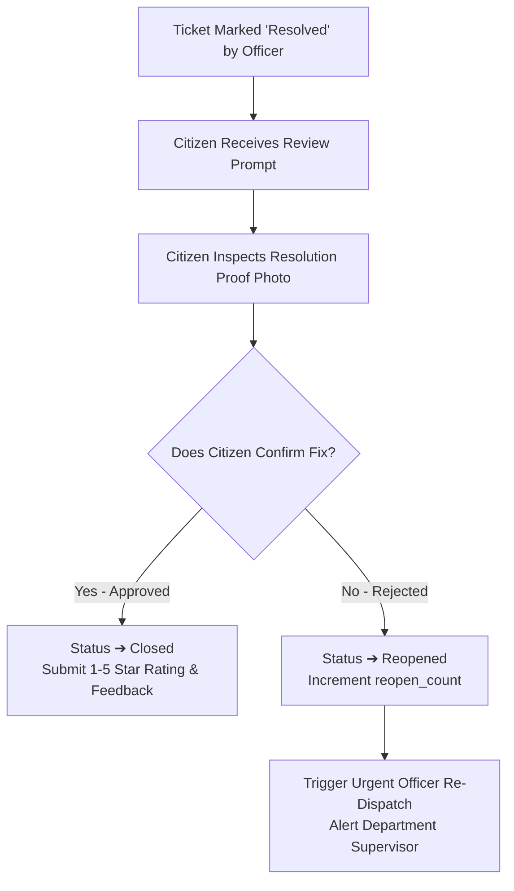
```mermaid
flowchart TD
    Res["Ticket Marked 'Resolved' by Officer"] --> Notify["Citizen Receives Review Prompt"]
    Notify --> Inspect["Citizen Inspects Resolution Proof Photo"]
    Inspect --> Decision{"Does Citizen Confirm Fix?"}
    
    Decision -->|Yes - Approved| Close["Status ➔ Closed\nSubmit 1-5 Star Rating & Feedback"]
    Decision -->|No - Rejected| Reopen["Status ➔ Reopened\nIncrement reopen_count"]
    Reopen --> Escalate["Trigger Urgent Officer Re-Dispatch\nAlert Department Supervisor"]
```

#### How It Works (Short Description)
* Places final verification authority in the hands of the reporting citizen.
* Citizens view the "Before" vs "After" photos on their dashboard.
* **Approved**: Ticket status becomes `Closed`, citizen submits a 1–5 star rating and optional comments.
* **Rejected**: Ticket status returns to `Reopened`, increments `reopen_count`, and triggers an urgent re-dispatch alert to the officer.
* **Key Files**: `frontend/src/app/citizen/dashboard/page.tsx`, `backend/app/routers/complaints.py`.

---

### Phase 14: SLA Tracking, Warning Timers & Escalation Engine

#### Flowchart
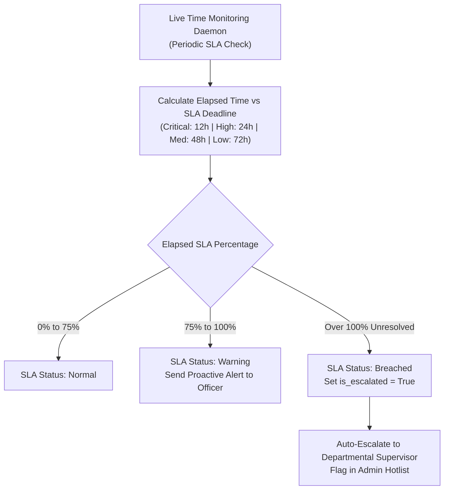
```mermaid
flowchart TD
    Clock["Live Time Monitoring Daemon\n(Periodic SLA Check)"] --> Calc["Calculate Elapsed Time vs SLA Deadline\n(Critical: 12h | High: 24h | Med: 48h | Low: 72h)"]
    Calc --> StateCheck{"Elapsed SLA Percentage"}
    
    StateCheck -->|0% to 75%| Norm["SLA Status: Normal"]
    StateCheck -->|75% to 100%| Warn["SLA Status: Warning\nSend Proactive Alert to Officer"]
    StateCheck -->|Over 100% Unresolved| Breach["SLA Status: Breached\nSet is_escalated = True"]
    
    Breach --> Escalation["Auto-Escalate to Departmental Supervisor\nFlag in Admin Hotlist"]
```

#### How It Works (Short Description)
* Automatically enforces citizen service charters based on grievance priority:
  * **Critical**: 12 hours
  * **High**: 24 hours
  * **Medium**: 48 hours
  * **Low**: 72 hours
* Dynamically shifts SLA status: `Normal` (&le; 75%) &rarr; `Warning` (75%–100%) &rarr; `Breached` (> 100%).
* Automatically flags overdue tickets (`is_escalated = True`) and notifies agency supervisors.
* **Key Files**: `backend/app/services/sla.py`.

---

### Phase 15: GIS Mapping & Operational Analytics Dashboard

#### Flowchart
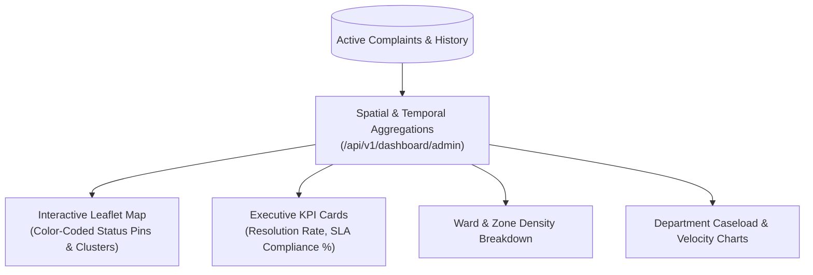
```mermaid
flowchart TD
    DB[(Active Complaints & History)] --> Aggr["Spatial & Temporal Aggregations\n(/api/v1/dashboard/admin)"]
    Aggr --> Map["Interactive Leaflet Map\n(Color-Coded Status Pins & Clusters)"]
    Aggr --> Metrics["Executive KPI Cards\n(Resolution Rate, SLA Compliance %)"]
    Aggr --> Heatmap["Ward & Zone Density Breakdown"]
    Aggr --> Velocity["Department Caseload & Velocity Charts"]
```

#### How It Works (Short Description)
* Centralized command-and-control center for state and municipal administrators (`/admin/dashboard`).
* Renders real-time geospatial pin clusters, ward-level complaint distribution, agency resolution velocity, and SLA compliance metrics.
* Enables filtering by agency, zone, status, priority, and date range.
* **Key Files**: `frontend/src/app/admin/dashboard/page.tsx`, `backend/app/routers/dashboard.py`.

---

### Phase 16: Predictive Machine Learning Intelligence & Early Warning

#### Flowchart
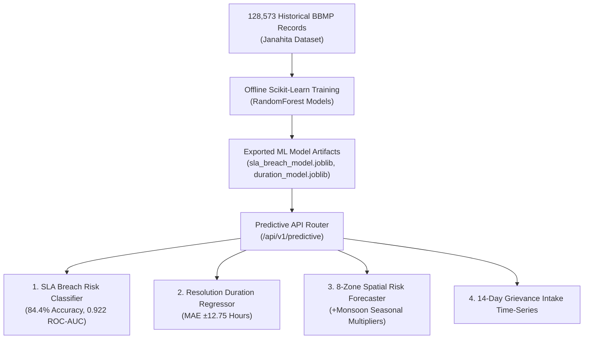
```mermaid
flowchart TD
    History["128,573 Historical BBMP Records\n(Janahita Dataset)"] --> Train["Offline Scikit-Learn Training\n(RandomForest Models)"]
    Train --> Models["Exported ML Model Artifacts\n(sla_breach_model.joblib, duration_model.joblib)"]
    
    Models --> API["Predictive API Router\n(/api/v1/predictive)"]
    API --> F1["1. SLA Breach Risk Classifier\n(84.4% Accuracy, 0.922 ROC-AUC)"]
    API --> F2["2. Resolution Duration Regressor\n(MAE ±12.75 Hours)"]
    API --> F3["3. 8-Zone Spatial Risk Forecaster\n(+Monsoon Seasonal Multipliers)"]
    API --> F4["4. 14-Day Grievance Intake Time-Series"]
```

#### How It Works (Short Description)
* Adds predictive intelligence trained on **128,573 historical municipal records**.
* **SLA Breach Risk Predictor**: Evaluates category, zone, priority, and current backlog to estimate breach probability.
* **Resolution Duration Regressor**: Forecasts expected hours to resolve (MAE $\pm 12.75$ hours).
* **Spatial Risk Forecaster**: Ranks all 8 Bengaluru zones using seasonal monsoon multipliers (+35% to +45% during peak monsoon).
* **14-Day Intake Forecasting**: Projects future grievance volumes per department for proactive crew staffing.
* **Key Files**: `backend/app/services/predictive.py`, `backend/app/routers/predictive.py`.

---

### Phase 17: Security Hardening, Automated E2E Testing & Deployment

#### Flowchart
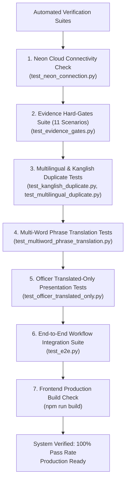
```mermaid
flowchart TD
    Suite["Automated Verification Suites"] --> T1["1. Neon Cloud Connectivity Check\n(test_neon_connection.py)"]
    T1 --> T2["2. Evidence Hard-Gates Suite (11 Scenarios)\n(test_evidence_gates.py)"]
    T2 --> T3["3. Multilingual & Kanglish Duplicate Tests\n(test_kanglish_duplicate.py, test_multilingual_duplicate.py)"]
    T3 --> T4["4. Multi-Word Phrase Translation Tests\n(test_multiword_phrase_translation.py)"]
    T4 --> T5["5. Officer Translated-Only Presentation Tests\n(test_officer_translated_only.py)"]
    T5 --> T6["6. End-to-End Workflow Integration Suite\n(test_e2e.py)"]
    T6 --> Build["7. Frontend Production Build Check\n(npm run build)"]
    Build --> Complete["System Verified: 100% Pass Rate\nProduction Ready"]
```

#### How It Works (Short Description)
* Verifies end-to-end platform integrity with an automated multi-suite testing harness covering the entire grievance lifecycle:
  1. `test_neon_connection.py`: Verifies Neon cloud database connectivity, SSL enforcement, and table schemas.
  2. `test_evidence_gates.py`: Validates all 11 evidence hard-gate scenarios (GPS deltas, timestamp freshness, semantic agreement, dHash).
  3. `test_kanglish_duplicate.py` & `test_multilingual_duplicate.py`: Verifies duplicate detection across Kannada, Kanglish, Hinglish, and English.
  4. `test_multiword_phrase_translation.py`: Validates longest-first multi-word Kannada phrase replacement.
  5. `test_officer_translated_only.py`: Guarantees field officers never receive untranslated native script in queues.
  6. `test_e2e.py`: Executes 13-step comprehensive lifecycle test from registration to citizen verification.
* Confirms zero regressions in ML inference, routing logic, SLA triggers, and Next.js frontend builds.
* **Key Files**: `backend/test_e2e.py`, `backend/test_evidence_gates.py`, `backend/test_neon_connection.py`, `TESTING_GUIDE.md`.

---

## 📊 Summary Matrix: All 17 Phases at a Glance

| Phase # | Phase Name | Primary Technology / Tools | Key Input | Key Output |
|:---:|---|---|---|---|
| **1** | Requirements & Domain | Specification Specs | Civic Problems | 4 Authorities, 47 Categories, Roles, State Rules |
| **2** | System Architecture | FastAPI, Next.js 16 | System Scope | Modular skeleton, CORS, Routing |
| **3** | Database & RBAC | Neon Cloud PostgreSQL, SQLAlchemy 2.0, JWT | User credentials | Neon DB pool, JWT tokens, Role guards, Tables |
| **4** | Karnataka Geography | Python Seeder (`seed.py`) | Civic structure | 4 Authorities, 8 Zones, 198 Wards, 47 Categories |
| **5** | Multimodal Intake | React 19, Leaflet, MediaAPI | Citizen submission | Multi-part form payload (Audio, Photo, GPS) |
| **6** | Translation & Clean | Google Translate + Local Multi-Word Fallback | Raw KN/EN/Hinglish | Normalized English text + Dual-field DB storage |
| **7** | NLP & Priority AI | SentenceTransformers (`all-MiniLM-L6-v2`) | Clean text | 47-Category & Priority (`Critical` to `Low`) |
| **8** | YOLOv8 Computer Vision| Ultralytics YOLOv8n, OpenCV | Evidence photo | Detected objects & Quality Diagnostics |
| **9** | Evidence Trust Scoring | Haversine + EXIF + 4 Hard Gates | GPS, Photo, Text | Composite Trust (0–100%) & Decision States |
| **10** | Duplicate AI | Haversine (100m) + Translated Text Embeddings | New complaint | Unique ticket OR Linked duplicate (`impact_count`) |
| **11** | Smart Agency Routing | Least-Load Balancing | Verified ticket | Dispatched officer & Status update |
| **12** | Officer Operations | Next.js Dashboard, Translated English View | Assigned case | Proof photo & Status = `Resolved` |
| **13** | Citizen Verification | Next.js Dashboard, Rating | Resolution proof | `Closed` (Rating) OR `Reopened` |
| **14** | SLA Escalation | Periodic Daemon | Active timers | `Normal` &rarr; `Warning` &rarr; `Breached` |
| **15** | GIS Analytics | Leaflet, React, ChartJS | Ticket telemetry | Spatial pins, Hotspot heatmaps |
| **16** | Predictive ML | Scikit-Learn RandomForest | 128k records | SLA risk, Duration, 14-day forecasts |
| **17** | E2E Testing & Hardening| Python Unittest Suites (7 Suites), Next Build | Full codebase | 100% test pass rate, Production build |
